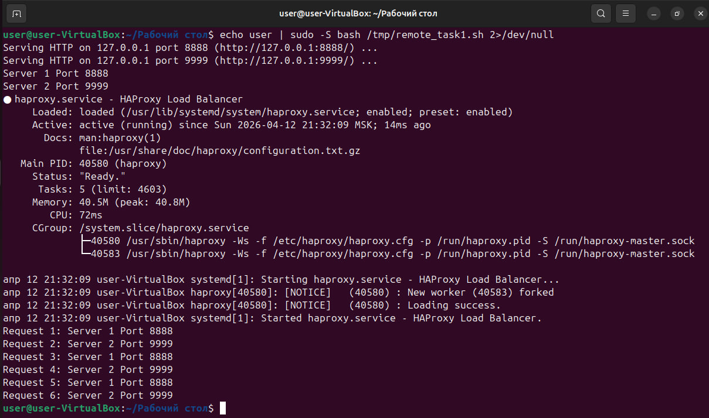
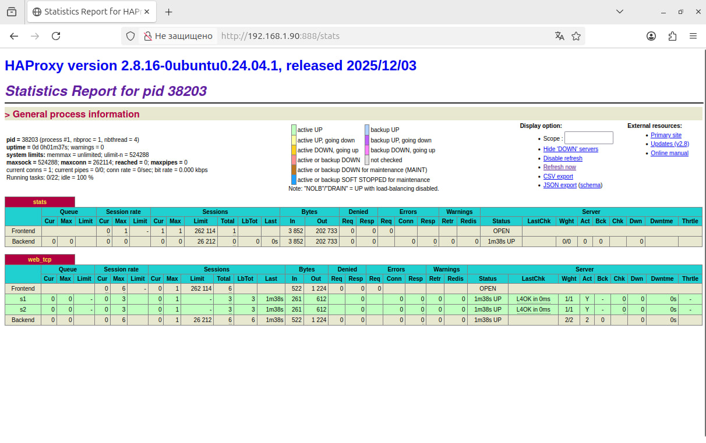
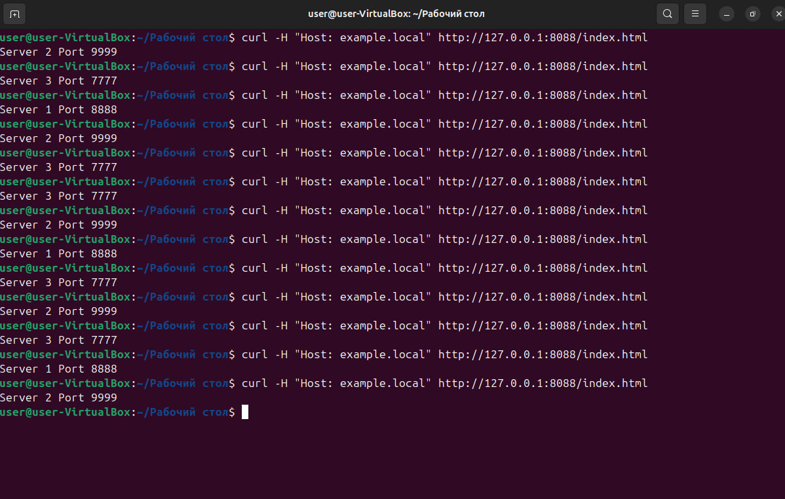
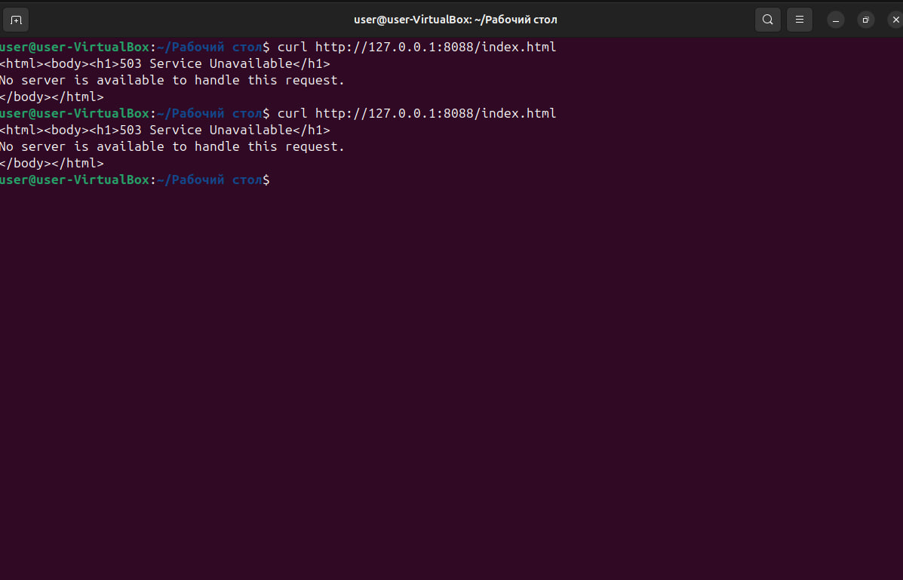
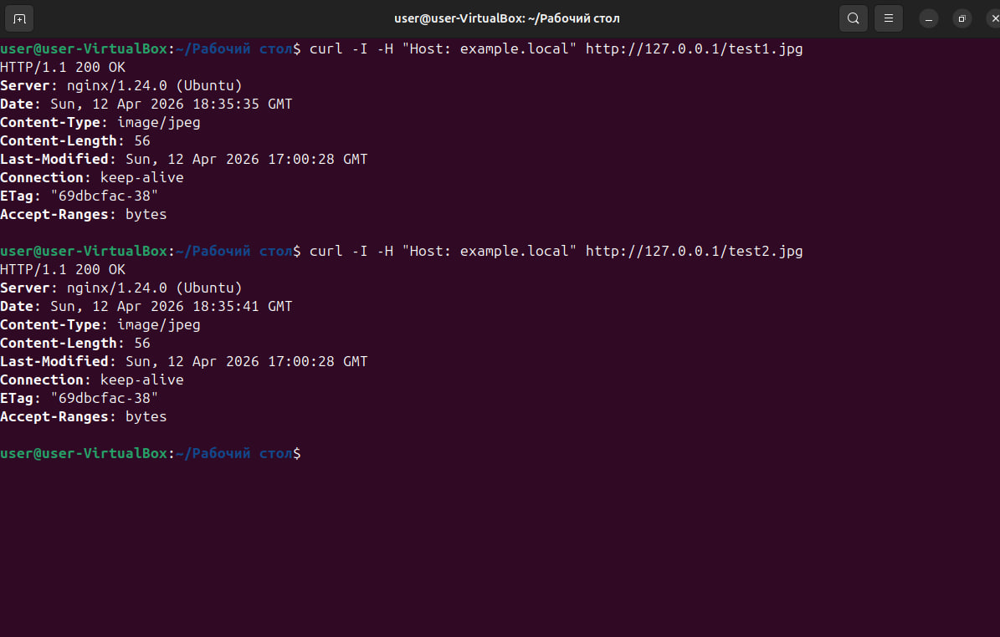
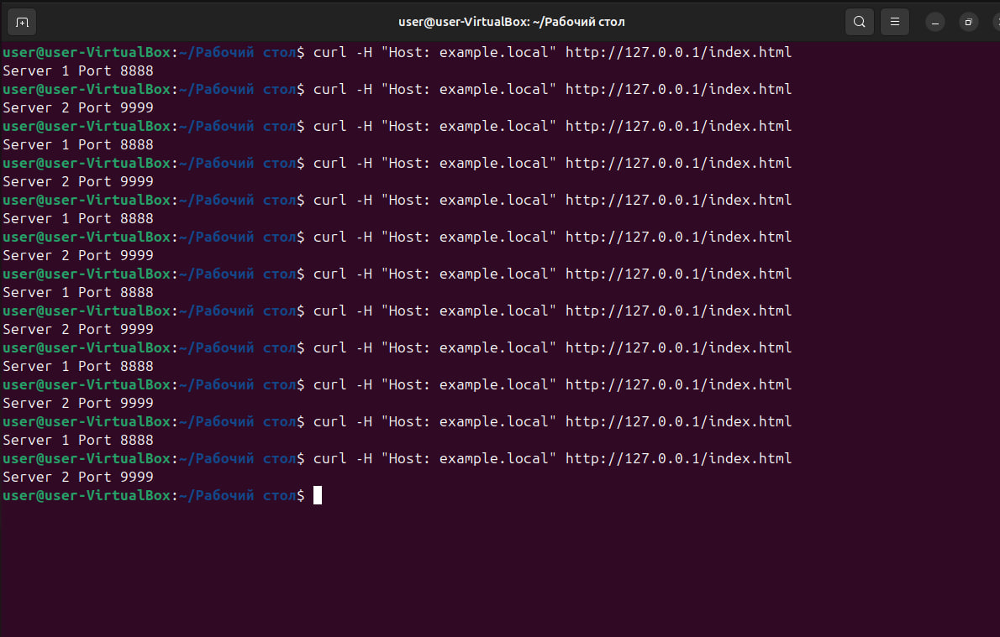
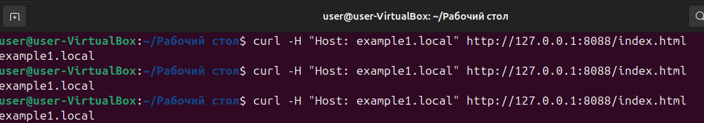
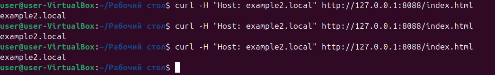

# Домашнее задание к занятию «Кластеризация и балансировка нагрузки» - `Страхов Игорь`

---

### Задание 1

Запустил два simple python сервера на портах 8888 и 9999. Установил HAProxy, настроил балансировку Round-robin на 4 уровне.

1. Запустил python http серверы:
```bash
cd /opt/http1 && python3 -m http.server 8888 --bind 127.0.0.1 &
cd /opt/http2 && python3 -m http.server 9999 --bind 127.0.0.1 &
```

2. Конфигурационный файл HAProxy: [haproxy.cfg](configs/task1/haproxy.cfg)

3. Перезапустил HAProxy `sudo systemctl restart haproxy` и проверил curl-запросами — запросы чередуются между серверами:



4. Страница статистики HAProxy на http://192.168.1.90:888/stats:



---

### Задание 2

Запустил три simple python сервера на портах 8888, 9999 и 7777. Настроил балансировку Weighted Round Robin на 7 уровне: первый сервер — вес 2, второй — 3, третий — 4. HAProxy балансирует только трафик, адресованный домену example.local (ACL).

1. Запустил python http серверы:
```bash
cd /opt/http1 && python3 -m http.server 8888 --bind 127.0.0.1 &
cd /opt/http2 && python3 -m http.server 9999 --bind 127.0.0.1 &
cd /opt/http3 && python3 -m http.server 7777 --bind 127.0.0.1 &
```

2. Конфигурационный файл HAProxy: [haproxy.cfg](configs/task2/haproxy.cfg)

3. Запросы с указанием домена example.local — балансировка работает, запросы распределяются по весам:



4. Запросы без указания домена — HAProxy возвращает 503, так как ACL не срабатывает:



---

### Задание 3*

Настроил связку HAProxy + Nginx. Nginx принимает запросы на порту 80: файлы .jpg отдаёт сам из /var/www/, остальные запросы проксирует на HAProxy (порт 8088), который балансирует между двумя python серверами.

1. Конфигурация Nginx: [example-local](configs/task3/example-local)

2. Конфигурация HAProxy: [haproxy.cfg](configs/task3/haproxy.cfg)

3. Запрос jpg-файла — Nginx отдаёт его сам (Server: nginx):



4. Запрос html — проксируется через HAProxy на python серверы, ответы чередуются:



---

### Задание 4*

Запустил 4 simple python сервера: на портах 8881, 8882 — отдают страницу example1.local, на портах 8883, 8884 — example2.local. Настроил два бэкенда HAProxy и фронтенд с ACL-маршрутизацией по доменному имени.

1. Конфигурационный файл HAProxy: [haproxy.cfg](configs/task4/haproxy.cfg)

2. Запросы к example1.local — ответ приходит от бэкенда web_servers_1:



3. Запросы к example2.local — ответ приходит от бэкенда web_servers_2:


